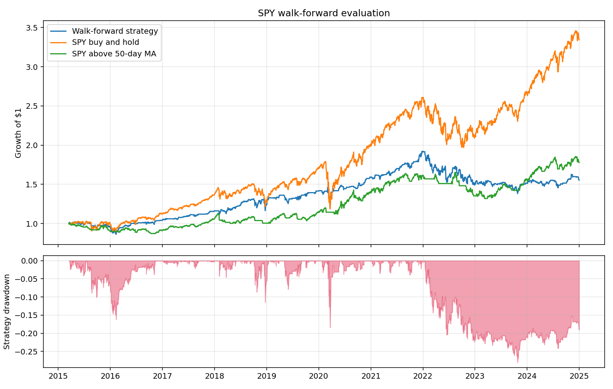
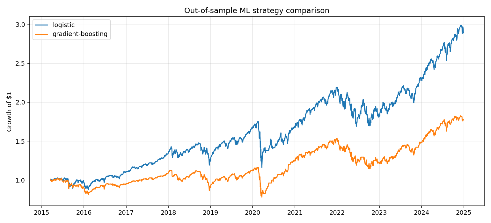
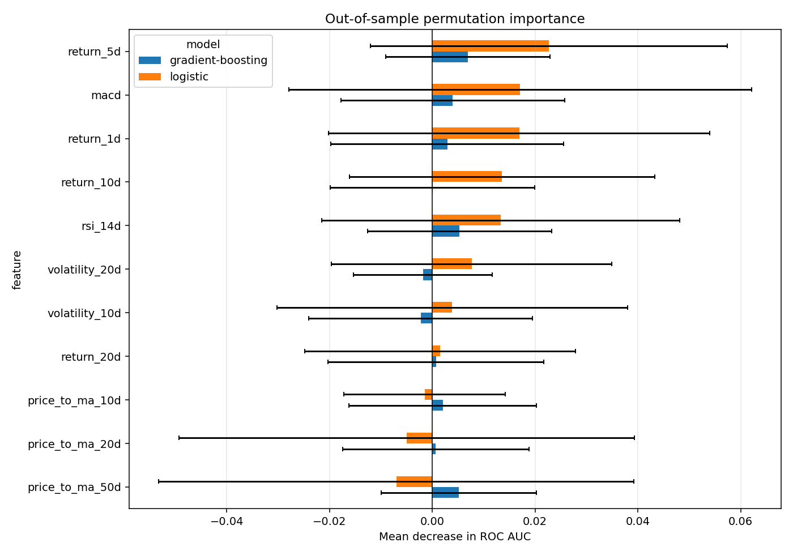
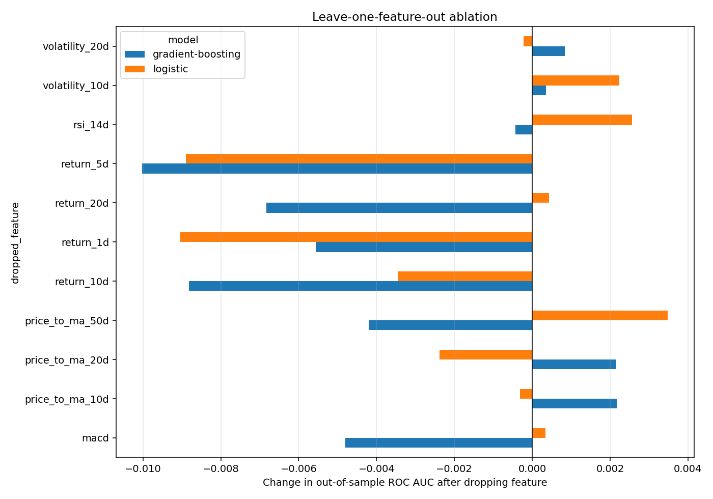
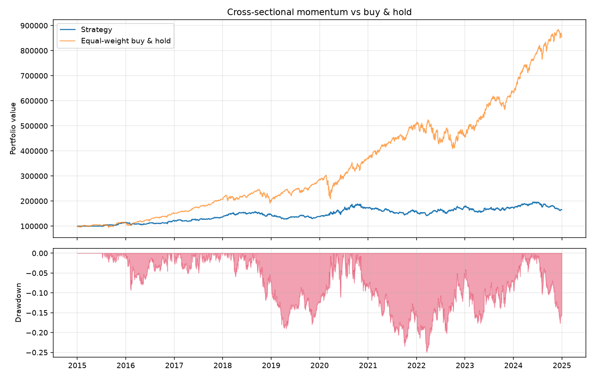

# quantbot

A systematic trading research platform: research a signal, backtest it without
lying to yourself, then run it against a paper account.

The point of this repo is not to get rich. It is to do the boring things
correctly—no lookahead, honest transaction costs, and benchmarks you actually
have to beat—because that is what separates a real backtest from a plot that
goes up.

## Results

### Walk-forward SPY classification

The walk-forward experiment trains a logistic classifier on at least five years
of past SPY observations, predicts the next unseen one-year block, and expands
the training window after each fold. It never uses a random train/test split.

The model uses 11 point-in-time features: returns over four horizons, distance
from three moving averages, volatility over two windows, RSI, and MACD. The
generated run contains 2,466 unique out-of-sample decisions from 2015-03-16
through 2024-12-30. It uses a 0.55 probability threshold and charges 5 bps of
turnover costs.

| Portfolio | CAGR | Cumulative return | Volatility | Sharpe | Max drawdown | Hit rate | Position changes | Annual turnover |
| --- | ---: | ---: | ---: | ---: | ---: | ---: | ---: | ---: |
| Walk-forward strategy | 5.44% | 67.90% | 13.34% | 0.46 | -18.46% | 39.38% | 860 | 87.99x |
| SPY buy and hold | 13.13% | 234.45% | 17.68% | 0.79 | -33.72% | 54.84% | 0 | 0.00x |
| SPY above 50-day MA | 6.06% | 77.92% | 10.58% | 0.61 | -20.26% | 54.67% | 177 | 18.19x |



The classifier trails buy-and-hold in this sample. That is the honest
out-of-sample result; the validation and reporting infrastructure is the
deliverable, not a tuned winning backtest. Its high turnover also shows that a
probability threshold alone is not yet a practical execution policy.

### Model comparison

Logistic regression and histogram gradient boosting are evaluated on exactly
the same features and expanding-window folds. Both use a fixed 0.55 entry and
0.45 exit policy: probabilities in between keep the previous position. These
thresholds were specified before the comparison rather than tuned on the test
period.

| Model | Accuracy | Precision | Recall | ROC AUC | CAGR | Sharpe | Max drawdown | Position changes | Annual turnover |
| --- | ---: | ---: | ---: | ---: | ---: | ---: | ---: | ---: | ---: |
| Logistic regression | 54.26% | 54.72% | 94.96% | 0.491 | 12.22% | 0.75 | -30.39% | 20 | 2.15x |
| Gradient boosting | 53.65% | 55.85% | 72.87% | 0.516 | 7.67% | 0.54 | -30.86% | 375 | 38.32x |



The comparison does not show a strong predictive edge: both ROC-AUC values are
close to random ranking. Logistic regression's trading result mainly comes
from staying invested for long stretches, as its high recall and low number of
position changes make clear. Gradient boosting trades much more frequently
without improving risk-adjusted performance.

### Feature importance and ablation

Permutation importance is calculated only on each unseen test fold. A feature
is shuffled within that fold, never in the training data, and its decrease in
ROC-AUC is averaged over 10 folds and five deterministic repeats.

| Model | Highest-ranked feature | Mean ROC-AUC decrease | Standard deviation |
| --- | --- | ---: | ---: |
| Logistic regression | 5-day return | 0.0227 | 0.0348 |
| Gradient boosting | 5-day return | 0.0069 | 0.0159 |



The uncertainty is larger than the mean importance for every feature, so these
rankings are not evidence of stable standalone predictors. The strongest
shared candidate is the 5-day return, while several moving-average and
volatility features have near-zero or negative permutation importance.

Leave-one-feature-out ablation reruns the complete walk-forward experiment
after removing each feature:



- Removing 1-day or 5-day returns reduces logistic ROC-AUC by about 0.009.
- Removing the 5-day return reduces gradient-boosting ROC-AUC by about 0.010.
- Removing some moving-average features slightly improves gradient boosting,
  suggesting redundancy or noise rather than independent signal.
- Changes in Sharpe can be much larger than changes in ROC-AUC because a small
  probability shift can alter entry and exit timing. They should not be treated
  as evidence for feature selection without another untouched test period.

The experiment writes:

```text
results/
├── feature_ablation.csv
├── feature_ablation.png
├── permutation_importance.csv
├── permutation_importance.png
├── metrics.csv
├── model_comparison.csv
├── model_comparison.png
├── logistic_predictions.csv
├── gradient_boosting_predictions.csv
├── predictions.csv
└── performance.png
```

`predictions.csv` makes every decision inspectable with:

```text
date,close,target,probability,position,market_return,strategy_return
```

### Cross-sectional momentum

Cross-sectional momentum on 10 large-cap US equities, 2015–2024, 5 bps costs,
monthly rebalance:

| | Strategy | Buy & hold |
| --- | ---: | ---: |
| CAGR | 5.2% | 24.0% |
| Volatility | 12.9% | 18.6% |
| Sharpe | 0.46 | 1.25 |
| Sortino | 0.64 | 1.56 |
| Max drawdown | -25.0% | -31.1% |
| Calmar | 0.21 | 0.77 |
| Hit rate | 51.8% | 56.4% |



The strategy loses to buy and hold, and that is the honest result. Long/short
momentum on ten mega-caps over a strong equity decade fights a rising market on
the short leg, while ten names give the cross-sectional ranking little to sort.

It is reported as-is on purpose. Tuning the lookback, universe, and date range
until the blue line wins is easy and produces a number that means nothing out
of sample.

## Install

```bash
git clone https://github.com/vinwiegman/quant.git
cd quant
python -m venv .venv
```

Activate the environment:

```bash
# macOS/Linux
source .venv/bin/activate

# Windows PowerShell
.venv\Scripts\Activate.ps1
```

Install the development and machine-learning dependencies:

```bash
pip install -e ".[dev,ml]"
```

## Use

Run the walk-forward SPY evaluation and generate `results/`:

```bash
quantbot walk-forward \
  --start 2010-01-01 \
  --end 2024-12-31 \
  --min-train-years 5 \
  --test-years 1 \
  --out results
```

Compare both ML models under identical evaluation conditions:

```bash
quantbot compare-models \
  --start 2010-01-01 \
  --end 2024-12-31 \
  --entry-threshold 0.55 \
  --exit-threshold 0.45 \
  --out results
```

Evaluate one model or enable hysteresis explicitly:

```bash
quantbot walk-forward \
  --model gradient-boosting \
  --threshold 0.55 \
  --exit-threshold 0.45
```

Run out-of-sample permutation importance and feature ablation:

```bash
quantbot analyze-features \
  --model all \
  --start 2010-01-01 \
  --end 2024-12-31 \
  --repeats 5 \
  --out results
```

Run the cross-sectional momentum backtest:

```bash
quantbot backtest \
  --tickers AAPL,MSFT,NVDA,JPM,XOM \
  --start 2018-01-01 \
  --out docs/
```

Use the backtest engine directly:

```python
from quantbot import CrossSectionalMomentum, run_backtest
from quantbot.data import load_prices

prices = load_prices(["AAPL", "MSFT", "NVDA", "JPM", "XOM"], start="2018-01-01")
weights = CrossSectionalMomentum(lookback=126, n_long=2, n_short=2).generate(prices)
result = run_backtest(prices, weights, cost_bps=5.0)

print(result.summary())
```

## Walk-forward design

`quantbot.validation.walk_forward`:

1. Creates chronological, expanding-window folds.
2. Fits a fresh estimator using earlier observations only.
3. Predicts each next unseen block.
4. Preserves the original dates on out-of-sample probabilities.
5. Rejects duplicate prediction dates.
6. Converts probabilities to target weights.
7. Sends those weights through the existing cost-aware backtest engine.
8. Reports the strategy beside SPY buy-and-hold and the SPY 50-day filter.

The prediction on date *t* uses information available through that close,
becomes a held position on *t+1*, and earns the next close-to-close return.

## Project design

```text
data/        price loading and reproducible Parquet caching
signals/     Signal interface and portfolio-weight generation
validation/  expanding-window model evaluation and reporting
backtest/    vectorized, cost-aware engine and metrics
broker/      paper broker and weight-to-order translation
```

Three decisions carry most of the weight:

**Signals return weights, not orders.** A signal says “I want to be 30% long
NVDA,” not “buy 12 shares.” Position sizing and order generation live in the
broker layer, so the same strategy object drives both the backtester and paper
account.

**Lookahead is prevented at execution.** `run_backtest` applies
`weights.shift(1)`, so a signal computed at the close of day *t* can only earn
the return of day *t+1*. The walk-forward harness adds a second barrier by
fitting each model exclusively on dates earlier than its test block.

**Costs are charged on turnover, not on trade count.** Cost is
`Σ|Δw| × bps`, which makes rebalance frequency show up directly in P&L.

## Testing

```bash
pytest --cov=quantbot
ruff check .
```

The suite checks metric arithmetic, drawdown and transaction-cost invariants,
signal execution timing, and the walk-forward guarantees:

- Every training date precedes every test date.
- Test observations never enter model fitting.
- Out-of-sample predictions retain their dates.
- Every test date is predicted at most once.

## Limitations

- **Survivorship bias.** Tickers are selected today; failed companies are
  absent. Real cross-sectional research needs a point-in-time universe.
- **Simple classifier.** The SPY experiment is an infrastructure MVP, not a
  claim that logistic regression on technical features is the best model.
- **Costs are a flat estimate.** There is no market-impact model, short-borrow
  cost, or crisis-dependent spread.
- **Daily close-to-close only.** There is no intraday execution, gap model, or
  partial fills.
- **Small momentum universe.** Ten names give a cross-sectional rank little to
  sort.

## License

MIT
